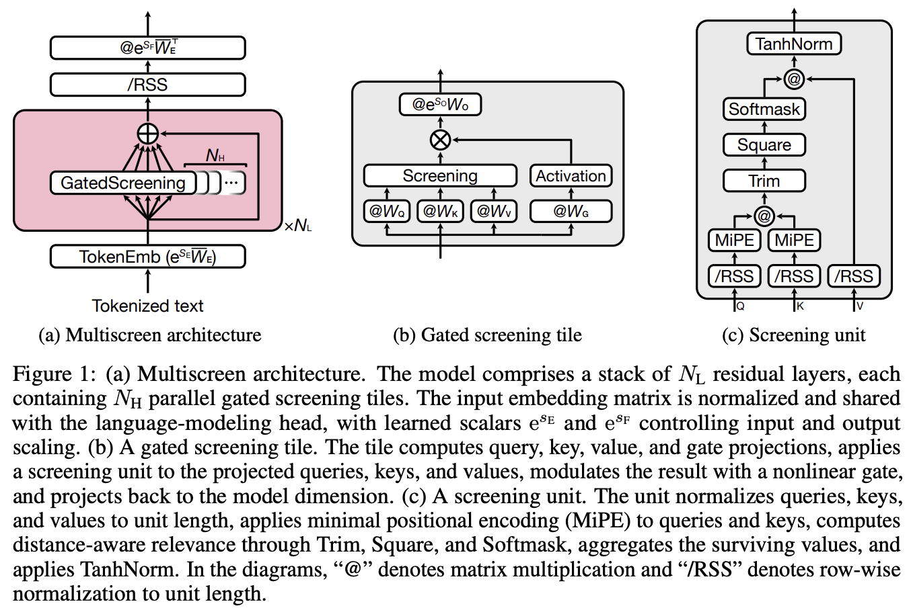

</img>

## MultiScreen

Implementation of Multiscreen proposed by Ken Nakanishi for [Screening is Enough](https://arxiv.org/abs/2604.01178)

Basically it is a non-softmax attention with ReLU squared activation, content similarity thresholding, and aggressive normalization of the values.

## Install

```bash
$ pip install multiscreen
```

## Usage

```python
import torch
from multiscreen import MultiScreen

multi_screen = MultiScreen(
    num_tokens = 256,
    dim = 512,
    depth = 6,
    heads = 8,
    dim_keys = 16,     # paper says 16 or 32
    dim_values = 64    # paper says 64 or 128
)

token_ids = torch.randint(0, 256, (1, 1024))

logits = multi_screen(token_ids)
assert logits.shape == (1, 1024, 256)
```

## Citations

```bibtex
@misc{nakanishi2026screening,
    title   = {Screening Is Enough},
    author  = {Ken M. Nakanishi},
    year    = {2026},
    eprint  = {2604.01178},
    archivePrefix = {arXiv},
    primaryClass = {cs.LG},
    url     = {https://arxiv.org/abs/2604.01178},
}
```

```bibtex
@misc{zhang2021sparse,
    title   = {Sparse Attention with Linear Units},
    author  = {Biao Zhang and Ivan Titov and Rico Sennrich},
    year    = {2021},
    eprint  = {2104.07012},
    archivePrefix = {arXiv},
    primaryClass = {cs.CL}
}
```
